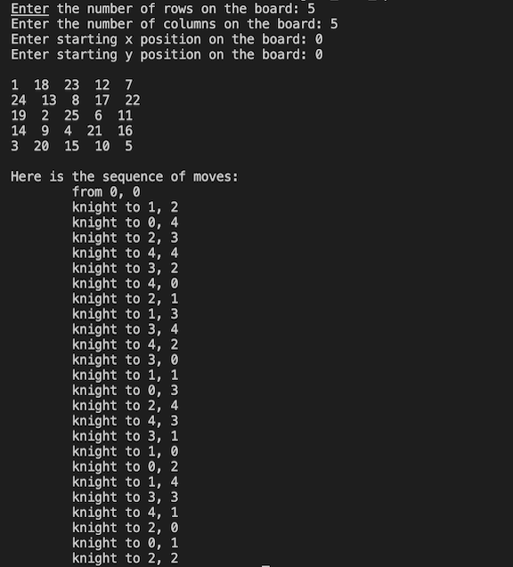
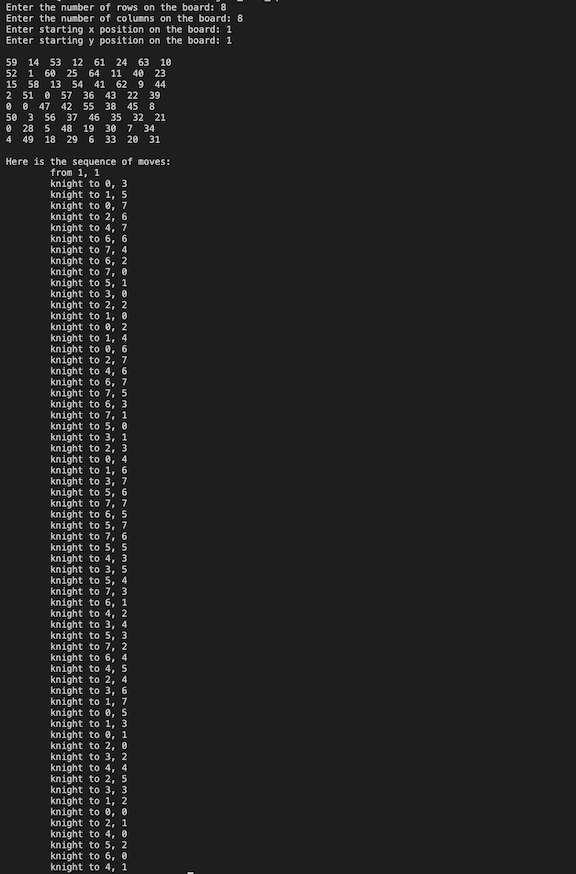

# Knight's Tour Problem Visual Solver

## Two approaches for an open tour of a knight on a chess board

This project was something I built out of curiosity after I stumbled upon the Knight's Tour problem. The scripts
provided, each in their own way find a valid path for an open tour for a knight chess piece. Provided are a 
bruteforce approach and a more heuristic solution using [Warnsdorff's rule](https://en.wikipedia.org/wiki/Knight%27s_tour).

# How to use

Instructions assume that the user has Git installed. If not installed, the [documentation](https://git-scm.com/book/en/v2/Getting-Started-Installing-Git) may help. All is done on the terminal.

1. Create or navigate to a directory to clone the repository, and then clone it with this terminal command.
```
git clone https://github.com/C3viche/Knights-Tour.git
```
2. Provided should be the up-to-date executable. Navigate to "Heuristic" or "Bruteforce" directory and run the executable.
```
cd Heuristic 
./knights_tour_op.exe
```
or
```
cd Bruteforce
./knights_tour.exe
```
3. The following input is required for each.

    ### Heuristic Solution (RECOMMENDED)

    * Dimensions of the abstract "chess board" (m x n)
    * The starting position of the knight in number coordinates
        * This is done because not all chess boards have letter indications
        * (0, 0) is the the top left corner, y increases going down the board, and x increases going right
    ### Brute Force

    Very unpolished. This was my beta version for the project so I highly recommend using the other program provided instead 
    (Heuristic Solution using Warnsdorff's rule). However this program still does work for small chess boards like 5x5 and 6x6.

    * The starting position of the knight in number coordinates:
        * must be entered as x, y
        * not input validation, so very error prone

## Keep in Mind

Some boards and some starting positions may lead to impossible tours or long computing time for the computer
so cancel the program with Ctrl + C if solution is not computed in under a minute. I am currently working on 
a script that automatically ends the program if not finished in time.
## Visuals



## Here are some resources I found interesting!
 * [Numberphile Video](https://www.youtube.com/watch?v=ab_dY3dZFHM) about interesting patterns in the knight's tour
 * [Article](https://www.sciencedirect.com/science/article/pii/S0166218X04003488) on an optimized solution